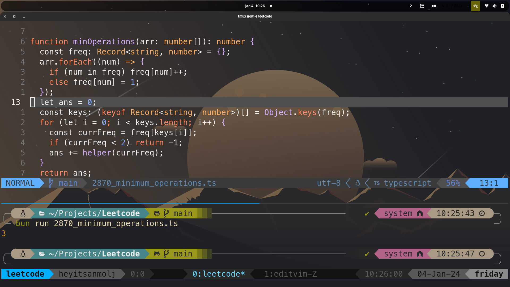

# Neovim Configuration

This repository contains my personalized Neovim configuration, designed to enhance productivity and provide a seamless coding experience.

## Screenshot



## Features

- **Plugin Management**: Efficiently managed using [lazy.nvim](https://github.com/folke/lazy.nvim).
- **Language Server Protocol (LSP) Support**: Integrated LSP configurations for enhanced code intelligence.
- **Autocompletion**: Powered by [nvim-cmp](https://github.com/hrsh7th/nvim-cmp) for intelligent code completion.
- **File Explorer**: Navigate your project with ease using [nvim-tree.lua](https://github.com/kyazdani42/nvim-tree.lua).
- **Syntax Highlighting**: Enhanced code readability with [nvim-treesitter](https://github.com/nvim-treesitter/nvim-treesitter).
- **Fuzzy Finder**: Quickly find files, symbols, and more with [telescope.nvim](https://github.com/nvim-telescope/telescope.nvim).
- **Git Integration**: Seamless Git operations within Neovim using [vim-fugitive](https://github.com/tpope/vim-fugitive).
- **Status Line**: Aesthetic and informative status line with [lualine.nvim](https://github.com/nvim-lualine/lualine.nvim).

## Installation

1. **Backup Existing Configuration**:

   ```bash
   mv ~/.config/nvim ~/.config/nvim.bak
   ```

2. **Clone This Repository**:

   ```bash
   git clone https://github.com/anmoljhamb/nvim-config.git ~/.config/nvim
   ```

3. **Install Plugins**:
   Launch Neovim and install the plugins:

   ```vim
   :Lazy install
   ```

4. **Restart Neovim**:
   After installation, restart Neovim to apply the configuration.

## Usage

Open Neovim:

```bash
nvim
```

Explore the key mappings and plugins configured to enhance your development workflow.

## Customization

Feel free to modify the configuration files to suit your preferences. The main configuration file is `init.lua`, and additional settings are located in the `lua/` directory.

## Contributing

Contributions are welcome! If you encounter any issues or have suggestions for improvements, please open an issue or submit a pull request.

## License

This project is licensed under the MIT License. See the [LICENSE](LICENSE) file for more details.
